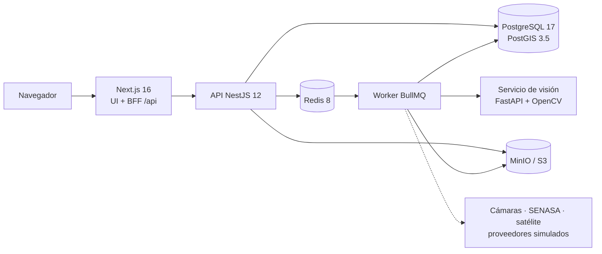

# AgroGarantías

Plataforma para la **verificación remota y recurrente de activos agropecuarios usados como
garantía** (bancos, aseguradoras). Combina cámaras en campo, imágenes satelitales y visión
computacional para producir, en cada verificación, un resultado **explicable, trazable e
inmutable**: cantidad detectada frente a la declarada, evidencia vinculada, controles cruzados,
score con sus componentes, alertas e informe PDF/CSV/JSON.

> Escenario de referencia (datos demo): rodeo de cría **La Esperanza**, 1.500 bovinos
> declarados → **1.482 detectados**, **99 % de coincidencia**, **score 82/100**
> (Documentación 90 · Existencia 85 · Historial 70 · Riesgo 68 · Consistencia 95).

---

## Contenido

1. [Inicio rápido](#inicio-rápido)
2. [Credenciales demo](#credenciales-demo)
3. [Recorrido funcional](#recorrido-funcional)
4. [Arquitectura](#arquitectura)
5. [Stack y versiones](#stack-y-versiones)
6. [Estructura del repositorio](#estructura-del-repositorio)
7. [Dependencias y por qué](#dependencias-y-por-qué)
8. [Desarrollo local sin Docker](#desarrollo-local-sin-docker)
9. [Variables de entorno](#variables-de-entorno)
10. [Endpoints principales](#endpoints-principales)
11. [Modelo de datos](#modelo-de-datos)
12. [Decisiones de arquitectura](#decisiones-de-arquitectura)
13. [Tests](#tests)
14. [Integraciones simuladas y limitaciones](#integraciones-simuladas-y-limitaciones)
15. [Roadmap de integraciones](#roadmap-de-integraciones)

---

## Inicio rápido

Requisitos: Docker con Compose v2.

```bash
cp .env.example .env        # opcional: compose trae valores de desarrollo por defecto
docker compose up -d --build
```

Compose levanta PostgreSQL/PostGIS, Redis, MinIO, el servicio de visión, aplica migraciones,
carga la cartera demo (servicio `migrate`) y luego inicia API, worker y frontend.

| Servicio | URL |
|---|---|
| Aplicación | http://localhost:3000 |
| API (OpenAPI en desarrollo) | http://localhost:4000/api/docs |
| Salud de la API | http://localhost:4000/health/ready |
| Consola MinIO | http://localhost:9001 |

Sólo se publican en tu máquina los puertos 3000, 4000, 9000 y 9001; PostgreSQL, Redis y el
servicio de visión quedan dentro de la red de Docker. Si alguno de esos puertos ya está en uso,
cambialo en `.env` (`WEB_PORT=3001`, `API_PORT=4001`, `MINIO_PORT=9100`,
`MINIO_CONSOLE_PORT=9101`) y volvé a ejecutar `docker compose up -d`.

Para volver a la cartera demo inicial: `docker compose down -v && docker compose up -d`.

## Credenciales demo

Usuarios de **Banco del Campo** creados por el seed. La contraseña es el valor de
`SEED_DEMO_PASSWORD` (en `.env.example`: `AgroDemo2026!`); no está escrita en el código. La
pantalla de login la muestra sólo si `SHOW_DEMO_CREDENTIALS=true`.

| Usuario | Rol |
|---|---|
| `maria.lopez@bancodelcampo.com.ar` | Administrador |
| `federico.gimenez@bancodelcampo.com.ar` | Analista de riesgo |
| `laura.benitez@bancodelcampo.com.ar` | Auditor (solo lectura + auditoría) |
| `martin.sosa@bancodelcampo.com.ar` | Consulta |

Existe una segunda organización (Pampa Seguros) para verificar el aislamiento multi-tenant.

## Recorrido funcional

1. **Login** → **Panel de cartera**: activos, garantías activas, valor declarado por tipo, score
   ponderado, distribución de riesgo, últimas verificaciones y alertas.
2. **Activos y garantías** → *Rodeo de cría La Esperanza*: 1.500 cabezas declaradas, mapa con el
   límite del establecimiento y las cámaras, documentación (RENSPA, contrato, DNI/CUIT), evidencia,
   dispositivos, historial e identificación individual.
3. **Verificar ahora** → progreso real por etapa (publicado por el worker) → resultado: 1.482
   detectados, 99 %, confianza 86 %, **82/100** con el desglose y factores de cada componente,
   controles cruzados (geocerca, RENSPA simulado, cámaras), galería de evidencia con conteo,
   modelo, confianza, ubicación y hora, historial, trazabilidad y métricas.
4. **Ver informe completo** (PDF por URL firmada), CSV o JSON. **Confirmar como garantía**.
5. **Mis garantías**: mapa por estado (OK, Alerta, En revisión, Observado), actividad reciente y
   tabla de cartera con filtros.
6. **Alertas**: tomar y resolver (con nota obligatoria). **Informes**: descargas y regeneración.
7. **Nuevo activo**: “¿Qué activos querés poner como garantía?” → establecimiento (existente o
   nuevo, con mapa) → datos y metadata del tipo → documentación → dispositivos (“Quiero que me
   envíen el kit” / “Ya instalé mis dispositivos”) o fotos → verificación.
8. **Configuración**: usuarios, pesos del score, reglas de alerta, integraciones y modelos
   (indicando cuáles son simulados) y registro de auditoría.
9. **Escáner de Bovinos** (portal del productor → solicitud → *Escanear rodeo*): la cámara del
   celular detecta y cuenta bovinos en vivo (YOLOX-Nano en el dispositivo, modo fijo en manga o
   barrido), funciona sin señal y se sincroniza solo; el servidor recalcula el conteo oficial.
   Ver [`docs/scanner.md`](docs/scanner.md); para probarlo desde tu celular:
   `./scripts/phone-test.sh` y [`docs/phone-testing.md`](docs/phone-testing.md).

## Arquitectura

Detalle completo, diagramas Mermaid y decisiones en [`docs/architecture.md`](docs/architecture.md).



- **Monolito modular** NestJS (dominio / aplicación / infraestructura / presentación por módulo)
  + **worker** separado para el pipeline de verificación, informes y monitoreo.
- **Verificación asíncrona** (`202 Accepted`, `jobId = id de la corrida`, reintentos con backoff),
  **inmutable** (triggers en PostgreSQL) y **reproducible** (snapshot de entrada, pesos, versiones
  de modelos).
- **Puertos y adaptadores** para visión computacional, imágenes satelitales, cámaras, registro
  ganadero y almacenamiento.
- **ScoringEngine** puro, determinístico, con pesos configurables por organización y versión.
- **AlertEngine** con reglas configurables (CRITICAL / WARNING / INFO) evaluadas en cada
  verificación y en el monitoreo periódico.

## Stack y versiones

Versiones verificadas al momento del desarrollo (octubre 2026).

| Capa | Tecnología |
|---|---|
| Runtime | Node.js 24 (imágenes) / 22+ (local), Python 3.13 |
| Frontend | Next.js 16.3.8 (App Router, `proxy.ts`, salida standalone), React 19.3, TanStack Query 5, MapLibre GL 6.11 (teselas OpenStreetMap) |
| API | NestJS 12.1 (ESM), TypeORM 1.1, class-validator 0.15, Ajv 8, @nestjs/throttler 6, helmet 8, argon2 0.45, pino 10 / nestjs-pino 5 |
| Colas | BullMQ 6.3 sobre Redis 8 |
| Base de datos | PostgreSQL 17 + PostGIS 3.5 (`postgis/postgis:17-3.5-alpine`) |
| Almacenamiento | S3 compatible: MinIO (`chainguard/minio`) en desarrollo; AWS SDK v3 |
| Informes | PDFKit 0.20 (PDF), CSV y JSON propios |
| Visión computacional | FastAPI 0.142, Uvicorn 0.54, OpenCV headless 5.0, NumPy 2.5, Pillow 12, pydantic-settings 2 |
| Calidad | TypeScript 6.0, oxlint (type-aware), ESLint 9 + eslint-config-next, Prettier 3, Ruff |
| Tests | Vitest 4, Testing Library, Supertest, Playwright 1.63, pytest 9 |
| Paquetes | pnpm 10 (workspaces), uv (Python, `uv.lock`) |

## Estructura del repositorio

```
.
├── apps/
│   ├── api/                      # NestJS: API REST + worker
│   │   ├── src/
│   │   │   ├── modules/          # alerts, animals, assets, audit, auth, computer-vision, devices,
│   │   │   │                     # documents, establishments, evidence, external-data, health,
│   │   │   │                     # integrations, monitoring, organizations, reports, satellite,
│   │   │   │                     # scoring, storage, users, verification
│   │   │   ├── common/           # auth, errores, archivos, geo, colas, logging, paginación
│   │   │   ├── database/         # migraciones, bootstrap, seed demo, reset (solo desarrollo)
│   │   │   ├── main.ts           # proceso API
│   │   │   └── worker.ts         # proceso worker
│   │   ├── test/                 # integración (Postgres/Redis/MinIO reales)
│   │   └── Dockerfile
│   ├── web/                      # Next.js
│   │   ├── src/app/              # login, dashboard, assets, assets/new, assets/[id],
│   │   │                         # assets/[id]/verification, verifications, monitoring, alerts,
│   │   │                         # reports, settings, api/[...path] (BFF)
│   │   ├── src/components/       # ui (design system), domain, charts, map, layout
│   │   ├── e2e/                  # Playwright
│   │   └── Dockerfile
│   └── ai-service/               # FastAPI + OpenCV (uv)
│       ├── src/agro_vision/      # api, domain (calidad, conteo, cambios), infraestructura
│       ├── scripts/              # generador determinístico de escenas sintéticas
│       ├── tests/
│       └── Dockerfile
├── infra/seed-assets/            # imágenes sintéticas (cámaras, satélite, objetos) + manifest
├── docs/architecture.md
├── scripts/dev.mjs               # desarrollo local: API + worker + web + visión
├── docker-compose.yml
└── .env.example
```

## Dependencias y por qué

| Dependencia | Motivo |
|---|---|
| NestJS | Inyección de dependencias y módulos para un monolito modular con puertos/adaptadores; guards para auth/RBAC; mismo código para API y worker. |
| TypeORM + SQL de migraciones escrito a mano | Entidades tipadas, pero el esquema (PostGIS, triggers, índices parciales) se controla en SQL explícito. |
| PostgreSQL + PostGIS | Geocercas, superficies geodésicas e índices espaciales en la base. |
| BullMQ + Redis | Trabajos asíncronos con reintentos, backoff, idempotencia por `jobId`, progreso y schedulers. |
| argon2 | Hash de contraseñas recomendado por OWASP. |
| Ajv | Validación estricta del JSON Schema de metadata de cada tipo de activo. |
| zod | Validación de variables de entorno al arrancar (rechaza secretos de desarrollo en producción). |
| PDFKit | Generación de PDF en el worker sin navegador headless. |
| AWS SDK v3 | Cliente S3 estándar (MinIO, AWS, otros) y URLs firmadas. |
| Next.js + React Query | App autenticada con BFF en el mismo origen; cache y polling de estados. |
| MapLibre GL | Mapas vectoriales/raster open source (sin API keys). |
| FastAPI + OpenCV | Análisis de imagen en Python con un contrato HTTP tipado. |
| Playwright / Vitest / Supertest / pytest | E2E sobre el stack real, componentes, integración HTTP y dominio de visión. |

## Desarrollo local sin Docker

Requisitos: Node.js 22.9+, pnpm 10, Python 3.13 con [uv](https://docs.astral.sh/uv/) y Docker
(sólo para la infraestructura).

```bash
cp .env.example .env
pnpm install
uv sync --directory apps/ai-service
pnpm infra:up                 # PostgreSQL (5432), Redis (6379) y MinIO, publicados en localhost
pnpm db:bootstrap             # compila la API, migra, crea el bucket y carga los datos demo
pnpm dev                      # API :4000, worker, web :3000, visión :8000
```

| Script | Descripción |
|---|---|
| `pnpm build` | Compila API y frontend |
| `pnpm lint` / `pnpm typecheck` / `pnpm format` | Calidad (oxlint, ESLint, tsc, Prettier) |
| `pnpm test` | Tests de API (unitarios + integración) y de frontend |
| `pnpm test:ai` / `pnpm lint:ai` | Tests y lint del servicio de visión |
| `pnpm test:e2e` | Playwright contra el stack en ejecución (`BASE_URL`, por defecto http://localhost:3000) |
| `pnpm migration:run` | Aplica migraciones (TypeORM CLI) |
| `pnpm seed` | Carga los datos demo |
| `pnpm db:reset` | **Sólo desarrollo**: borra el esquema y las colas y recarga la demo (se niega en producción) |

Los tests de integración usan una base `agrogarantias_test`, el bucket `agrogarantias-test` y la
base Redis 5, sobre la misma infraestructura local.

## Variables de entorno

Todas están documentadas en [`.env.example`](.env.example) con valores **sólo de desarrollo**.
Con `NODE_ENV=production` la API se niega a iniciar si detecta secretos de ejemplo,
`COOKIE_SECURE=false` o el proveedor de visión simulado.

| Grupo | Variables |
|---|---|
| General | `NODE_ENV`, `PORT`, `LOG_LEVEL`, `LOG_FORMAT` (`json`/`pretty`) |
| PostgreSQL | `DATABASE_URL`, `DATABASE_POOL_MAX`, `POSTGRES_DB`, `POSTGRES_USER`, `POSTGRES_PASSWORD` |
| Redis | `REDIS_URL` |
| Almacenamiento | `S3_ENDPOINT`, `S3_PUBLIC_ENDPOINT` (host de las URLs firmadas), `S3_REGION`, `S3_BUCKET`, `S3_ACCESS_KEY`, `S3_SECRET_KEY`, `S3_FORCE_PATH_STYLE`, `SIGNED_URL_TTL_SECONDS`, `MINIO_ROOT_USER`, `MINIO_ROOT_PASSWORD` |
| Autenticación | `JWT_ACCESS_SECRET`, `JWT_ACCESS_TTL_SECONDS`, `REFRESH_TOKEN_TTL_DAYS`, `COOKIE_SECURE`, `WEB_ORIGIN` |
| Red y abuso | `TRUST_PROXY_HOPS`, `RATE_LIMIT_PER_MINUTE`, `RATE_LIMIT_LOGIN_PER_MINUTE` |
| Proveedores | `AI_SERVICE_URL`, `AI_SERVICE_TOKEN`, `AI_SERVICE_TIMEOUT_MS`, `CV_PROVIDER` (`ai-service`/`mock`), `SATELLITE_PROVIDER` (`mock`/`stac`), `STAC_API_URL`, `CAMERA_GATEWAY` (`simulated`), `REGISTRY_PROVIDER` (`mock`) |
| Procesamiento | `MONITORING_TICK_SECONDS`, `VERIFICATION_JOB_ATTEMPTS` |
| Demo | `SEED_DEMO_PASSWORD`, `SEED_ASSETS_DIR`, `SHOW_DEMO_CREDENTIALS`, `DEMO_LOGIN_EMAIL` |
| Frontend | `API_INTERNAL_URL`, `MAP_STYLE_URL`, `MAP_TILE_ORIGINS`, `ASSET_ORIGINS` |
| Servicio de visión | `AI_SERVICE_TOKEN`, `AI_SERVICE_ENVIRONMENT`, `AI_SERVICE_LOG_LEVEL` |

## Endpoints principales

Todos bajo `/api` (salvo salud). Documentación OpenAPI interactiva en `/api/docs` (fuera de
producción). Las mutaciones requieren el header `x-csrf-token`.

| Método y ruta | Descripción |
|---|---|
| `POST /auth/login` · `POST /auth/refresh` · `POST /auth/logout` · `GET /auth/me` | Sesión (cookies httpOnly, rotación de refresh token) |
| `GET /dashboard/summary` | KPIs, riesgo y actividad de la cartera |
| `GET /monitoring/portfolio` · `GET /monitoring/events` | “Mis garantías” y eventos |
| `GET/PUT /assets/:id/monitoring` | Frecuencia de verificación automática |
| `GET /asset-types` | Catálogo con estrategia, documentos y JSON Schema |
| `GET/POST /establishments` | Establecimientos con ubicación y límite |
| `GET/POST /assets` · `GET/PATCH /assets/:id` | Activos (metadata validada contra el esquema del tipo) |
| `GET/POST /assets/:id/documents` · `POST /establishments/:id/documents` | Documentación con requisitos |
| `GET /documents/:id/download` · `PATCH /documents/:id/review` | URL firmada y revisión |
| `GET/POST /assets/:id/evidence` | Evidencia (carga manual con hash y ubicación) |
| `GET /assets/:id/devices` · `POST /assets/:id/devices/kit-request` · `POST /assets/:id/devices` | Kit o dispositivo instalado |
| `POST /assets/:id/verifications` → **202** | Inicia una verificación |
| `GET /verifications` · `GET /verifications/:id` · `GET /verifications/:id/evidence` | Estado, etapa en curso, resultado, métricas, cruces, historial, evidencia |
| `POST /verifications/:id/guarantee` | Confirmar como garantía |
| `GET /assets/:id/satellite` · `GET /assets/:id/animals` | Observaciones satelitales e identidad individual |
| `GET/PATCH /alerts/:id` · `GET /alerts` | Alertas: seguimiento y resolución con nota |
| `GET /alert-rules` · `PATCH /alert-rules/:id` | Reglas configurables |
| `POST /verifications/:id/reports` · `GET /reports` · `POST /reports/:id/generate` · `GET /reports/:id/download?format=PDF\|CSV\|JSON` | Informes |
| `GET /organization/scoring` · `PUT /organization/scoring/weights` | Pesos del score |
| `GET /integrations` · `GET /users` · `GET /audit-logs` | Proveedores/modelos, usuarios y auditoría |
| `GET /health/live` · `GET /health/ready` | Liveness y readiness (DB, Redis, almacenamiento) |

## Modelo de datos

36 tablas; diagrama ER y criterios en [`docs/architecture.md`](docs/architecture.md#6-modelo-de-datos).
Núcleo: `assets` + `asset_types` (estrategia, documentos requeridos y JSON Schema) +
`asset_metadata` versionada; `verification_runs` → `verification_results`,
`verification_metrics`, `verification_evidence` (evidencia + versión de modelo usada) y
`external_data_snapshots`; `alerts`/`alert_rules`; `reports`/`report_documents`; `guarantees`;
`monitoring_configurations`/`monitoring_events`; `audit_logs`. Preparado para identidad
individual: `animals`, `animal_identifications`, `animal_observations`.

## Decisiones de arquitectura

Resumen (detalle en [`docs/architecture.md`](docs/architecture.md#9-decisiones-de-arquitectura)):

- Monolito modular + worker separado; verificación asíncrona e idempotente con BullMQ.
- Resultado inmutable y reproducible: snapshot de entrada, pesos, versión de modelos y de pipeline.
- Visión computacional en un servicio Python aislado, detrás de un puerto reemplazable.
- Conteo con visión computacional clásica (sin datos de entrenamiento), con confianza declarada.
- Integraciones sin credenciales implementadas como **simuladas y señalizadas**, nunca como reales.
- BFF en Next.js: los tokens viven en cookies `httpOnly`; CSRF double-submit; CSP con nonce.
- Metadata por JSON Schema para agregar tipos de activo sin migraciones.
- El cruce con el RENSPA compara contra toda la hacienda declarada en el establecimiento.

## Tests

| Suite | Herramienta | Resultado |
|---|---|---|
| API — unitarios (scoring, alertas, metadata, firmas de archivo, geo, entorno, CSV, satélite, filtro de errores) | Vitest | **43/43** |
| API — integración (auth y sesión, multi-tenancy y RBAC, activos/documentos/dispositivos, flujo completo de verificación) | Vitest + Supertest sobre PostgreSQL/Redis/MinIO reales | **34/34** |
| Frontend — componentes y librerías (metadata por JSON Schema, score, badges, progreso, cliente HTTP, formatos, login) | Vitest + Testing Library | **26/26** |
| Servicio de visión (calidad, conteo, cambios, API) | pytest | **16/16** |
| E2E (login/logout, La Esperanza de punta a punta, alta de activo → documento → dispositivo → evidencia → verificación → alerta → informe) | Playwright contra `docker compose up` | **5/5** |

Lint y formato: oxlint, ESLint, Prettier y Ruff sin errores; `tsc --noEmit` sin errores.

## Integraciones simuladas y limitaciones

**Simulado (y señalizado como tal en datos, UI e informes):**

- **Cámaras en campo**: `SimulatedCameraGateway` devuelve cuadros sintéticos por número de serie.
  Un equipo registrado sin cuadro asociado se informa honestamente “sin señal”.
- **SENASA / RENSPA**: `MockLivestockRegistryProvider` con fixtures; no existe API pública
  utilizable sin convenio.
- **Imágenes satelitales**: el análisis NDVI y de cambios es simulado. El adaptador STAC
  (`SATELLITE_PROVIDER=stac`) hace búsquedas y obtiene metadatos reales de Sentinel-2, pero no
  calcula índices y lo informa como capacidad no disponible.

**Limitaciones del MVP:**

- El contador de animales es visión computacional clásica calibrada sobre escenas sintéticas;
  con imágenes reales debe reemplazarse o recalibrarse (por ejemplo, un detector entrenado) — la
  interfaz `ComputerVisionProvider` y el registro de versiones de modelo ya lo contemplan.
- Las imágenes demo son sintéticas y deterministas (generadas por
  `apps/ai-service/scripts/generate_synthetic_scenes.py`).
- Mapa base: teselas públicas de OpenStreetMap, sujetas a su política de uso; para producción
  configurar `MAP_STYLE_URL` con un proveedor propio o contratado (y `MAP_TILE_ORIGINS`).
- Rate limiting por IP detrás del BFF: Next.js sólo agrega `X-Forwarded-For` si el cliente no lo
  envía. En producción, ubicar un ingress que fije ese header y usar `TRUST_PROXY_HOPS=2`. El
  bloqueo de cuenta por intentos fallidos aplica igual (por usuario).
- El score demo de 82/100 se reproduce sobre una carga fresca de datos (las verificaciones del
  mismo día no inflan el historial, pero alertas o cambios posteriores sí lo modifican).
- Single-region, sin alta disponibilidad configurada. El error tracking está abstraído en el
  puerto `ErrorReporter` (HTTP y workers); el adaptador por defecto emite logs estructurados y no
  hay proveedor externo conectado.
- Envío de notificaciones (email/SMS/webhooks) de alertas: no incluido.

## Roadmap de integraciones

| Integración | Estado actual | Próximo paso |
|---|---|---|
| Cámaras (RTSP/ONVIF o API del fabricante) | Gateway simulado | Adaptador `CameraGateway` por fabricante; capturas programadas y firma de origen |
| RFID (caravanas electrónicas) | Modelo `animals` / `animal_identifications` listo | Lectores en mangas/aguadas; conciliación con el conteo por CV |
| Modelo de detección entrenado | CV clásica | Detector (p. ej. familia YOLO) entrenado con imágenes de campo; registro en `ai_model_versions` y comparación A/B |
| Sentinel-2 real (NDVI) | Búsqueda STAC real, análisis simulado | Descarga de bandas B04/B08, cálculo de NDVI sobre el polígono, máscara de nubes |
| SENASA / RENSPA | Mock con fixtures | Convenio y API oficial o carga de constancias con OCR |
| Core bancario / originación de crédito | — | Webhooks y API de garantías confirmadas, vencimientos y alertas |
| Aseguradoras | — | Verificación de pólizas vigentes (hoy se toma de la documentación cargada) |
| Notificaciones | Eventos y alertas en la plataforma | Email, SMS y webhooks por regla y severidad |
| Error tracking / métricas | Logs JSON con `request_id` | Exportadores OpenTelemetry y proveedor de error tracking |
