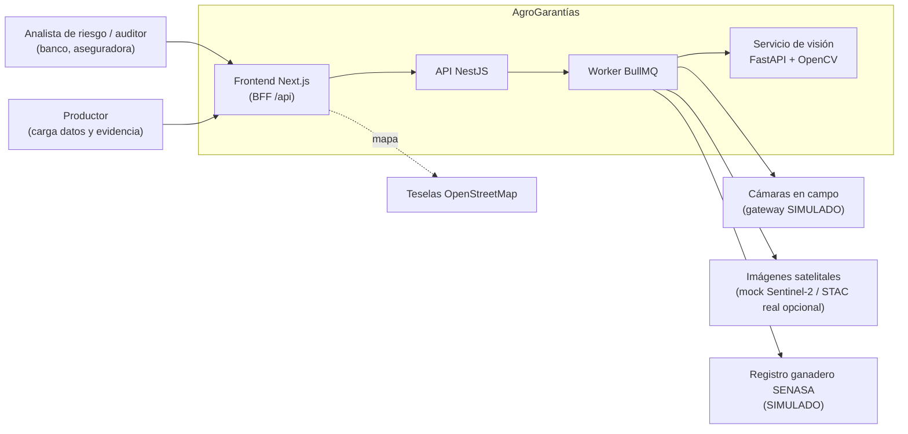
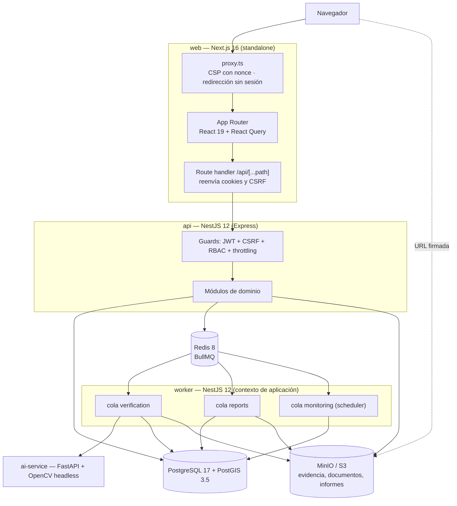
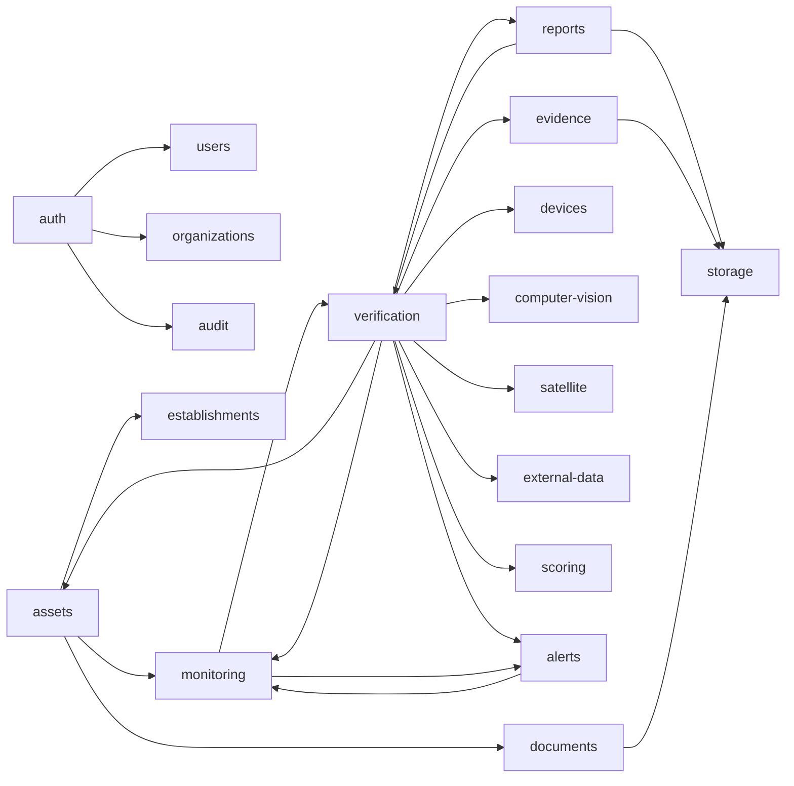
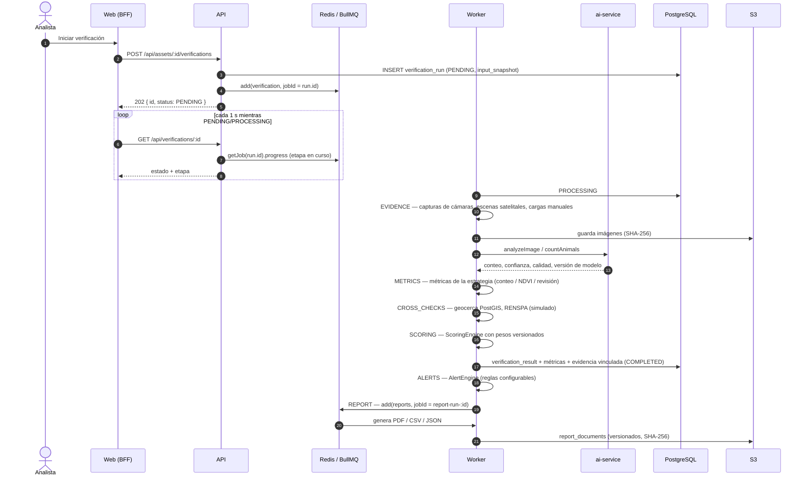
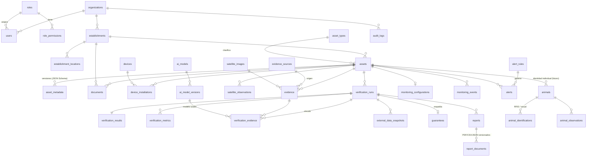

# Arquitectura de AgroGarantías

Plataforma de verificación remota y recurrente de activos agropecuarios usados como garantía
(bancos, aseguradoras). Este documento describe los componentes, los flujos principales, el
modelo de datos y las decisiones de arquitectura del MVP.

## 1. Vista de contexto



Las integraciones externas sin credenciales disponibles (cámaras, SENASA) están implementadas
como **proveedores simulados explícitos**: se identifican como tales en la base de datos
(`evidence_sources.is_simulated`, `external_data_snapshots.is_simulated`), en la UI (etiqueta
“Simulado”), en el score y en los informes PDF. Ninguna se presenta como integración real.

## 2. Contenedores



| Contenedor | Responsabilidad |
|---|---|
| `web` | UI, CSP por request, BFF: el navegador sólo habla con su propio origen; las cookies de sesión son `httpOnly`. |
| `api` | REST bajo `/api`, autenticación, autorización, validación, multi-tenancy, encolado de trabajos, URLs firmadas. |
| `worker` | Pipeline de verificación, generación de informes, monitoreo periódico. Escala independiente de la API. |
| `ai-service` | Análisis de imagen: calidad, conteo de animales, detección de cambios. Sin estado; autenticado con token interno. |
| `migrate` | Aplica migraciones, crea el bucket y carga los datos demo si la base está vacía. Termina al finalizar. |

## 3. Monolito modular (API)

Cada módulo sigue capas `domain` (reglas puras, sin Nest), `application` (casos de uso),
`infrastructure` (TypeORM, S3, colas, adaptadores) y `presentation` (controladores y DTOs).



Puertos (interfaces abstractas) y adaptadores:

| Puerto | Adaptadores | Selección |
|---|---|---|
| `ComputerVisionProvider` (`detectObjects`, `countAnimals`, `detectChanges`, `analyzeImage`) | `AiServiceComputerVisionProvider` (real, OpenCV), `MockComputerVisionProvider` | `CV_PROVIDER` |
| `SatelliteImageryProvider` (`searchImages`, `downloadImage`, `getMetadata`, `analyzeChange`) | `MockSatelliteProvider` (simulado), `StacSatelliteProvider` (búsqueda y metadatos reales vía STAC; el análisis no está disponible y lo informa) | `SATELLITE_PROVIDER` |
| `CameraGateway` | `SimulatedCameraGateway` (cuadros sintéticos por número de serie) | `CAMERA_GATEWAY` |
| `LivestockRegistryProvider` | `MockLivestockRegistryProvider` (fixtures SENASA/RENSPA) | `REGISTRY_PROVIDER` |
| `ObjectStorage` | `S3ObjectStorage` (MinIO, AWS S3 o compatible) | `S3_*` |

## 4. Flujo de verificación

La verificación es asíncrona, reproducible e inmutable. `POST` responde `202 Accepted` con el
id de la corrida; el job de BullMQ usa ese id como `jobId` (idempotencia) y reintenta con
backoff exponencial.



Estrategias por tipo de activo (`asset_types.verification_strategy`):

| Estrategia | Tipos | Evidencia | Medida |
|---|---|---|---|
| `LIVESTOCK_COUNTING` | Bovinos | Cámaras, cargas manuales | Cabezas detectadas por visión computacional |
| `VEGETATION_AREA` | Cultivos, Viñedos, Frutales, Forestal | Escena satelital sobre el polígono | Hectáreas con vegetación activa (NDVI) |
| `EVIDENCE_REVIEW` | Silobolsas, Silos, Maquinaria, Infraestructura, Reservorios, Otros | Fotos y cámaras | Actualidad, calidad, integridad y ubicación de la evidencia |

## 5. Score explicable

`ScoringEngine` es código de dominio puro (sin I/O), determinístico y versionado
(`agro-score/1.0.0`). Cada resultado guarda los pesos usados, los factores de cada componente y
la versión del modelo.

```
score = Σ peso_i × componente_i − penalización por anomalías
```

| Componente | Peso por defecto | Factores |
|---|---|---|
| Documentación | 20 % | Requisitos del tipo de activo, vigencia, revisión |
| Existencia verificada | 25 % | Coincidencia declarado/detectado × confianza, cantidad de evidencia |
| Historial | 20 % | Días distintos con verificación (180 días), estabilidad, score previo |
| Riesgo | 15 % | Movilidad, tenencia, seguro, alertas abiertas, cobertura de dispositivos, registro oficial |
| Consistencia | 20 % | Actualidad de la evidencia, geocerca, concordancia con el registro (comparado con toda la hacienda del establecimiento) |

Los pesos son configurables por organización (`PUT /api/organization/scoring/weights`, deben
sumar 1, quedan auditados) y no alteran verificaciones anteriores.

## 6. Modelo de datos



Decisiones del modelo:

- **Extensible por tipo**: `asset_types` define unidad, estrategia, fuentes de evidencia,
  documentación requerida y un **JSON Schema** de metadata (validado con Ajv en la API y
  renderizado como formulario en la UI). Agregar un tipo de activo no requiere migraciones.
- **Geografía nativa**: `geometry(Point|MultiPolygon, 4326)` con índices GIST; geocercas con
  `ST_DWithin`/`ST_Within`, superficies geodésicas con `ST_Area(geography)`.
- **Inmutabilidad en la base**: triggers rechazan `UPDATE/DELETE` sobre `evidence`,
  `verification_results`, `verification_metrics`, `external_data_snapshots` y `audit_logs`; una
  `verification_run` cerrada (`COMPLETED`/`FAILED`) no puede modificarse.
- **Invariantes con índices parciales únicos**: una sola verificación activa por activo, una sola
  alerta abierta por regla y activo, una sola garantía activa por activo.
- **Multi-tenancy**: `organization_id` en todas las entidades de negocio; los repositorios filtran
  siempre por la organización del usuario autenticado (nunca por parámetros del cliente).
- **Identidad individual (futuro)**: `animals`, `animal_identifications`, `animal_observations`
  existen y se exponen, pero el conteo no depende de RFID.

## 7. Seguridad

```mermaid
sequenceDiagram
    participant B as Navegador
    participant W as Web (BFF)
    participant A as API
    B->>W: POST /api/auth/login (email, contraseña)
    W->>A: reenvía
    A->>A: argon2id verify · bloqueo tras 5 intentos · throttling por IP
    A-->>B: Set-Cookie ag_at (JWT 15 min, httpOnly) · ag_rt (refresh, httpOnly, path /api/auth, SameSite=Strict) · ag_csrf (legible)
    B->>W: POST /api/... + x-csrf-token
    W->>A: reenvía cookies + header
    A->>A: JWT válido · CSRF double-submit · permisos del rol (cache 30 s) · organización
    Note over A: 401 → el cliente llama /auth/refresh una vez:<br/>rotación del refresh token; reutilización ⇒ revoca la familia
```

- Contraseñas con **argon2id** (parámetros OWASP); comparación en tiempo constante incluso para
  usuarios inexistentes.
- **RBAC**: roles Administrador, Analista de riesgo, Auditor y Consulta con permisos granulares
  (`assets:write`, `verifications:run`, `guarantees:confirm`, `settings:manage`, …).
- **CSRF** double-submit, **CORS** restringido a `WEB_ORIGIN`, **helmet** en la API y **CSP con
  nonce** por request en el frontend.
- **Rate limiting** global y específico para login (`RATE_LIMIT_*`), detrás de
  `TRUST_PROXY_HOPS` proxies confiables.
- **Archivos**: tipo detectado por firma binaria (no por extensión), tamaño máximo, nombre
  saneado, hash SHA-256; descarga sólo mediante **URLs firmadas** de vida corta.
- **Validación** con `class-validator` (`whitelist`, `forbidNonWhitelisted`) y metadata con
  JSON Schema estricto; CSV de informes con neutralización de fórmulas.
- **Auditoría** append-only de inicios de sesión, cargas, verificaciones, garantías, alertas,
  descargas y cambios de configuración.
- **Secretos** sólo por entorno; en `NODE_ENV=production` la API rechaza valores de desarrollo,
  `COOKIE_SECURE=false` y el proveedor de visión simulado.

## 8. Observabilidad

- Logs JSON estructurados (pino) con `request_id` propagado del BFF a la API y al servicio de
  visión; redacción de cookies, tokens y contraseñas.
- `GET /health/live` (proceso) y `GET /health/ready` (PostgreSQL, Redis, almacenamiento) en la
  API; `/health/live` y `/health/ready` en el servicio de visión.
- Errores con forma uniforme (`error`, `message`, `details`, `requestId`) y sin detalles
  internos. Los errores no controlados (HTTP 5xx y fallos definitivos de jobs) se envían al puerto
  `ErrorReporter`; el adaptador por defecto (`LogErrorReporter`) emite un log estructurado. Un
  proveedor de error tracking se integra implementando ese puerto.

## 9. Decisiones de arquitectura

| # | Decisión | Motivo | Consecuencia |
|---|---|---|---|
| 1 | Monolito modular NestJS + worker separado | Un equipo, dominio acotado; límites claros por módulo | Se puede extraer un módulo a servicio si escala distinto |
| 2 | Verificación asíncrona con BullMQ, `jobId = run.id` | Tareas largas, reintentos, idempotencia | El cliente consulta el estado; progreso real publicado por etapa |
| 3 | Resultado inmutable con snapshot de entrada, pesos y versión de modelos | Auditoría crediticia y reproducibilidad | Una nueva verificación nunca reescribe la anterior |
| 4 | Visión computacional en servicio Python separado | Ecosistema OpenCV/numpy; aislamiento de dependencias nativas | Contrato HTTP versionado; reemplazable por un modelo entrenado |
| 5 | Conteo con CV clásica (ExG + morfología + componentes) | Funciona sin datos de entrenamiento ni GPU; explicable | Confianza base 0,86 declarada; debe recalibrarse con imágenes de campo |
| 6 | Proveedores simulados explícitos | No hay credenciales de cámaras ni de SENASA | Marcados en datos, UI e informes; reemplazables vía puerto |
| 7 | BFF en Next.js con cookies `httpOnly` | El token nunca queda accesible a JavaScript | Todas las llamadas pasan por el origen del frontend |
| 8 | Metadata por JSON Schema en `asset_types` | Nuevos tipos de activo sin migraciones | Validación estricta en API y formulario generado en UI |
| 9 | PostGIS para geocercas y superficies | Cálculos espaciales correctos y con índices | Requiere imagen `postgis/postgis` |
| 10 | MinIO (Chainguard) en desarrollo | MinIO dejó de publicar imágenes oficiales | Cualquier S3 compatible sirve en otros entornos |

## 10. Verificación con señales reales (CV y Sentinel-2)

### 10.1 Real vs. simulado

| Capacidad | Real (por defecto) | Simulado (explícito) |
|---|---|---|
| Conteo de ganado | `CV_PROVIDER=ai-service` + `AI_SERVICE_DETECTOR=yolox`: YOLOX-S (Megvii, Apache-2.0), pesos COCO oficiales en ONNX, ONNX Runtime en CPU | `CV_PROVIDER=mock` (tests) · `AI_SERVICE_DETECTOR=classical` (contador OpenCV, solo escenas sintéticas) |
| Imágenes satelitales | `SATELLITE_PROVIDER=stac`: Sentinel-2 L2A (ítems STAC + COG del bucket público `sentinel-cogs`, sin credenciales) | `SATELLITE_PROVIDER=mock`: serie SIMULADA, fuente `SATELLITE_SENTINEL2_SIMULATED` |
| Cámaras de campo | — | Gateway simulado: entrega imágenes de la biblioteca demo |
| Registro SENASA | — | Simulado |

Cada evidencia, observación y versión de modelo registra `simulated`/`isSimulated`. Las imágenes de cámara de la demo son **composiciones sintéticas** (recortes de bovinos de fotos reales de Open Images V7, CC BY 2.0, pegados sobre pastura procedural, con verdad de campo exacta); el conteo lo hace el detector real.

### 10.2 Pipeline de visión (ganado)

`validación (firma de archivo) → calidad (nitidez, exposición, dHash) → detección YOLOX-S (letterbox 640, decodificación por grilla, NMS por pasada) → mosaico SAHI-like para imágenes grandes (640 px, solape 0,2; fusión IoU/IoS) → filtro por clase (vaca/oveja/caballo) y confianza → conteo`.

Salida por imagen: `count`, `detections[]` (caja y score), `confidence` (score medio), `inference_passes`, `score_threshold`, `processing_ms`, modelo y versión. En la verificación se agregan `detected_quantity`, `absolute_difference`, `relative_error`, `match_percentage` y `detection_confidence`; las detecciones (hasta 500) quedan en el vínculo evidencia–verificación.

Benchmark (`apps/ai-service/benchmarks/`, `scripts/benchmark_cattle.py`): Open Images V7 Cattle/Bull sin *group-of*, 511 imágenes / 1.129 animales; umbral elegido en *validation*, métricas en *test*:

| Modelo | Clases | Mosaico | Umbral | MAE | Precisión | Recall | Error total | ms/img |
|---|---|---|---|---|---|---|---|---|
| YOLOX-Tiny | livestock | no | 0,25 | 0,95 | 0,84 | 0,58 | −30,7 % | 30 |
| **YOLOX-S** | livestock | no | 0,12 | **0,82** | 0,79 | 0,66 | −16,2 % | 97 |
| YOLOX-S | livestock | 640 | 0,25 | 0,91 | 0,69 | 0,66 | −4,9 % | 452 |
| YOLOX-M | livestock | no | 0,25 | 0,80 | 0,82 | 0,66 | −19,7 % | 218 |

Escenas densas (composiciones, `cattle-composites.json`): umbral 0,40 con mosaico calibrado en El Trébol (812 → 807); reportado en La Esperanza: 1.490 animales reales → 1.510 detectados (+1,3 %). Elegido YOLOX-S: mejor relación MAE/latencia en CPU, sin dependencia de PyTorch y con licencia permisiva (se descartó Ultralytics por AGPL).

### 10.3 Pipeline satelital (cultivos, viñedos, frutales, forestales)

`polígono del activo → búsqueda de escenas (STAC Earth Search; si no responde, ítems STAC del bucket por tile MGRS, incluidos tiles vecinos solapados) → filtro temporal (30 días) y por nubosidad de escena → lectura por ventana de B04/B08/SCL (COG por HTTP range) → máscara SCL (nubes, sombras, nieve, nodata) → NDVI = (B08−B04)/(B08+B04) → estadísticas sobre el polígono`.

Por observación: NDVI media/mediana/mín/máx/p10/p90/desvío, `vegetation_pct` y superficie con vegetación activa (umbral por tipo: cultivos 0,4; forestal 0,5; frutales 0,35; viñedos 0,3), nubosidad **sobre el lote**, fracción válida, calidad `GOOD`/`ACCEPTABLE`/`LOW_CONFIDENCE`, vista NDVI y color verdadero recortadas. `AI_SERVICE_MAX_CLOUD_COVER` (20 %) y fracción válida mínima (0,6) definen si es utilizable; las no utilizables quedan como evidencia **EXCLUIDA** con el motivo.

Detección de cambios (`satellite/domain/vegetation-change.ts`): contra la observación anterior y la mediana de 60 días; caída significativa si ≤ −15 % y ≥ 0,08 de NDVI. Solo se confirma con observaciones `GOOD` (con nubosidad parcial se informa como no confirmada). Fenología (`phenology.ts`): presiembra/implantación (por fecha de siembra y cultivo) y reposo invernal de perennes hacen la verificación **no concluyente** en lugar de una falsa alarma.

### 10.4 Motor, evidencia, alertas y monitoreo

- Estrategias por tipo (`LIVESTOCK_COUNTING`, `VEGETATION_AREA`, `EVIDENCE_REVIEW`); la evaluación de vegetación es una función pura (`vegetation-assessment.ts`) usada por el pipeline y por el seed. El score (`agro-score/1.0.0`) no cambió: recibe los resultados reales.
- Evidencia satelital: archivo = vista NDVI (SHA-256), metadatos `satellite`, `sceneId`, `tile`, `acquisitionDate`, `cloudCoverPct`, `bands`, `processingVersion`, `model`/`modelVersion`, ubicación (centroide) y `resultSha256` de las estadísticas.
- Alertas nuevas: `VEGETATION_DECLINE` ("Disminución significativa de actividad vegetal") y `OBSERVATION_LOW_CONFIDENCE`; `EVIDENCE_STALE` aplica también a vegetación. El contexto de cada alerta referencia `verificationId`, `evidenceIds`, `metric` y la regla (migración `1791000000000`).
- Monitoreo: el scheduler existente crea verificaciones periódicas que ejecutan estas estrategias; `GET /assets/:id/monitoring` expone `verificationStrategy`. `GET /assets/:id/satellite` devuelve la serie con estadísticas, calidad y vistas.

### 10.5 Datos demo reales

`infra/seed-assets/satellite/real/<lote>/` contiene series Sentinel-2 procesadas con el mismo código (`scripts/build_satellite_fixtures.py`): trigo (61 ha, VERIFICADO), maíz temprano (54 ha: barbecho → "Disminución significativa de actividad vegetal", hoy en implantación → no concluyente), eucaliptos (80 ha) y viñedo (12,5 ha: verificado en verano, no concluyente en reposo). Los lotes son parcelas reales detectadas por NDVI; titulares, cultivo declarado y montos son ficticios.

### 10.6 Pendiente para producción

- **Frutales (San José)**: no se encontró una parcela real con la segmentación automática (chacras unidas por cortinas de álamos); su historial sigue **SIMULADO** y está marcado como tal.
- Cámaras reales (gateway RTSP/ONVIF) y fine-tuning del detector con imágenes del campo (vista aérea/drone, ganado en corrales); el modelo COCO subcuenta animales pequeños o agrupados.
- Catálogo STAC con SLA o réplica propia, caché de COG y cola dedicada para lotes grandes; máscara de nubes con dilatación/modelo específico (s2cloudless).
- Polígonos cargados por el productor (KML/SHP) en lugar de los de la demo; validación de superposición con catastro.

## 11. Solicitudes de garantía (modelo productor → AgroGarantías → entidad)

Flujo: la entidad crea una **solicitud de garantía** (`POST /guarantee-requests`) y obtiene un
link; el **productor** lo abre (`/solicitud/<token>`, sin cuenta), registra o reutiliza el
establecimiento (mismo RENSPA y titular), declara el activo con el catálogo existente, carga
documentación y fotos, y envía la declaración. La solicitud pasa a **Lista para verificar** y se
ejecuta el pipeline de verificación existente (YOLOX-S / Sentinel-2, score, alertas). La entidad
consulta el resultado en `/requests/<id>`.

- Datos: tabla `guarantee_requests` (migración `1792000000000`); el resto reutiliza
  establishments, assets, documents, evidence, verification_runs/results y alerts. Los datos
  pertenecen a la organización solicitante (multi-tenancy sin cambios).
- Productor: usuario propio con rol `PRODUCER` (sin permisos sobre la cartera, deshabilitado
  para login con contraseña); las operaciones del link reutilizan los servicios existentes con
  esa identidad, por lo que quedan en el audit log.
- Link: token aleatorio de 256 bits, se guarda solo su SHA-256, vence a los 30 días y la entidad
  puede regenerarlo (invalida el anterior). Cada endpoint del link solo accede a su solicitud.
- Separación: la declaración enviada no puede modificarse (409) y la entidad no puede editar
  un activo declarado por el productor (403).
- Fuera de alcance de esta versión: emails/notificaciones, app móvil, RFID, cuentas de
  productor con varias solicitudes.

## 12. Portal del productor

El link de invitación es solo el **primer acceso**: el productor acepta la invitación creando
su acceso (email + contraseña, `POST /producer/requests/:token/accept`) sobre su usuario
PRODUCER y desde entonces ingresa por `/login` a su portal (`/productor`). Una vez aceptada, el
link deja de permitir operaciones. Si ya tiene cuenta de productor en la misma entidad, con el
mismo email y contraseña la nueva solicitud se suma a esa cuenta.

- API de sesión `GET|POST /producer/me…` (rol PRODUCER, solo sus solicitudes): inicio con
  tareas, detalle de la solicitud (progreso, documentos y evidencia), declaración
  (establecimiento, activo), fotos, documentos, envío y respuesta a pedidos de información.
  El rol PRODUCER no tiene permisos sobre la cartera de la entidad (403).
- Estados para el productor: Invitación pendiente, En preparación, Pendiente de
  documentación / evidencia, Lista para verificar, En verificación, Verificada, Requiere
  información, Finalizada. El productor no ve score ni alertas (evaluación de la entidad).
- Evidencia: cámara del teléfono o galería, varias fotos sin límite, quitar antes de enviar,
  fecha de captura del archivo, ubicación del teléfono si se permite (si no, la del activo) y
  descripción opcional. Instrucciones por tipo de activo en `asset_types.evidence_guidance`.
- Pedidos de información: la entidad pide documentación o evidencia
  (`POST /guarantee-requests/:id/information-requests`, tabla `information_requests`); el
  productor lo ve como tarea, aporta y lo marca respondido (exige un aporte nuevo posterior al
  pedido). Lo aportado es evidencia/documentación nueva con su auditoría: la declaración enviada
  sigue inmutable. Si la solicitud ya estaba enviada, AgroGarantías vuelve a verificar.

## 13. Calidad y trazabilidad de la evidencia

### 13.1 Ubicación de captura de las fotos

`evidence.location` contiene **solo** la ubicación de captura. El origen queda en `metadata.locationSource`:

| Origen | Significado |
|---|---|
| `DEVICE_GPS` | GPS del teléfono (`navigator.geolocation`, con permiso explícito) con precisión `locationAccuracyM` |
| `EXIF` | GPS embebido en la foto (parser propio `common/files/exif-gps.ts`) |
| `MANUAL` | Coordenadas editadas a mano por el usuario |
| `DEVICE_INSTALLATION` | Ubicación de la cámara fija |
| `ASSET_LOCATION` | Solo contexto: **no** se guarda como ubicación de captura (queda en `metadata.contextLocation`) y la UI lo muestra como "Ubicación del establecimiento" |
| `NONE` | Sin ubicación. Se advierte y se permite continuar |

La geocerca de la verificación usa solo ubicaciones de captura. Ver `evidence/domain/capture-location.ts`.

### 13.2 Conteo único entre fotos

Las detecciones de varias fotos no se suman sin más (`verification/domain/unique-count.ts`). Dos imágenes se consideran de animales **distintos** solo en estos casos:

- son de cámaras fijas distintas;
- o ambas tienen GPS/EXIF a más de 300 m (más la precisión declarada) y se tomaron con menos de 20 minutos de diferencia.

En cualquier otro caso se agrupan (unión de pares) y de cada grupo se toma el **máximo**. Por ejemplo, 14 + 14 sin ubicación da 14.

La corrida guarda estas métricas: `detections_sum`, `unique_estimated` y `overlap_groups`. Además registra la anomalía `POSSIBLE_EVIDENCE_DUPLICATION` ("Posible duplicación entre evidencias"). `detected_quantity` es la estimación de únicos. El detalle de la solicitud muestra la cantidad por foto, la suma, los únicos estimados y la confianza.

### 13.3 Análisis de documentos

Al cargar un documento, la API lo envía en segundo plano al servicio de visión (`POST /v1/documents/analyze`). El servicio lee la capa de texto del PDF (pdfium); si no hay texto, aplica OCR con RapidOCR (ONNX, CPU). Luego clasifica el tipo y extrae RENSPA, CUIT, titular y fechas.

La API compara esos datos con el establecimiento (`documents/domain/document-analysis.ts`) y guarda el resultado en `document_analyses`:

- `extracted_fields`;
- `extraction_confidence`;
- `validation_results`;
- `status`: `PENDING`, `CONSISTENT`, `REVIEW_REQUIRED` o `FAILED`.

El estado es "Revisión requerida" si se da alguna de estas condiciones:

- la confianza es menor a 0,75;
- un dato no coincide;
- falta un campo obligatorio del tipo;
- el documento está vencido.

El análisis **no certifica la autenticidad** del documento y no reemplaza la revisión humana (`documents:review`).

### 13.4 SENASA, RFID y fuentes cruzadas

- SENASA: puerto `LivestockRegistryProvider` con el adapter mock (simulado) y el placeholder oficial. Ver `docs/integrations/senasa.md`.
- RFID: `rfid_observations` y el puente del lector. Ver `docs/integrations/rfid.md`.
- **Fuentes cruzadas** (detalle de la solicitud, solo para la entidad) pone lado a lado lo que informa cada fuente:
  - declaración;
  - visión (únicos estimados);
  - RFID (30 días);
  - ubicación de las fotos;
  - lectura de documentos;
  - SENASA;
  - historial.

  Es informativo y **no modifica el score**.
