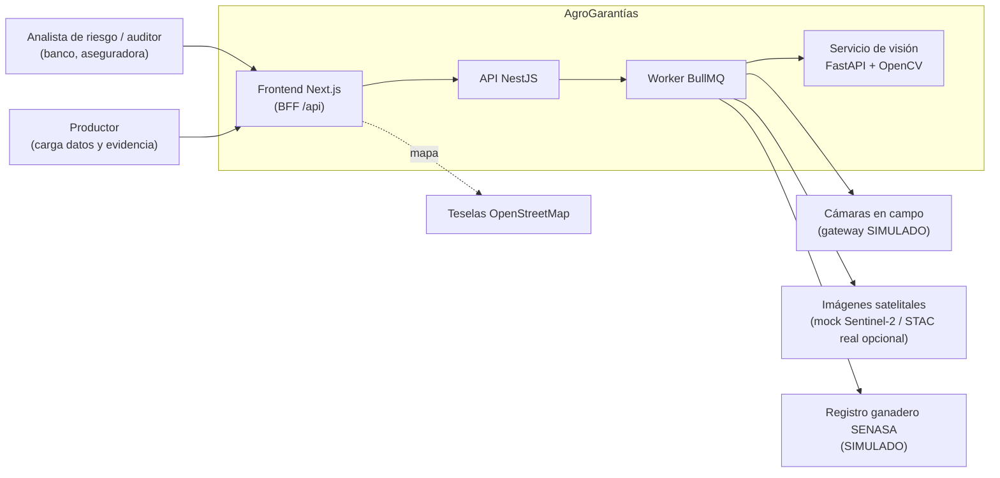
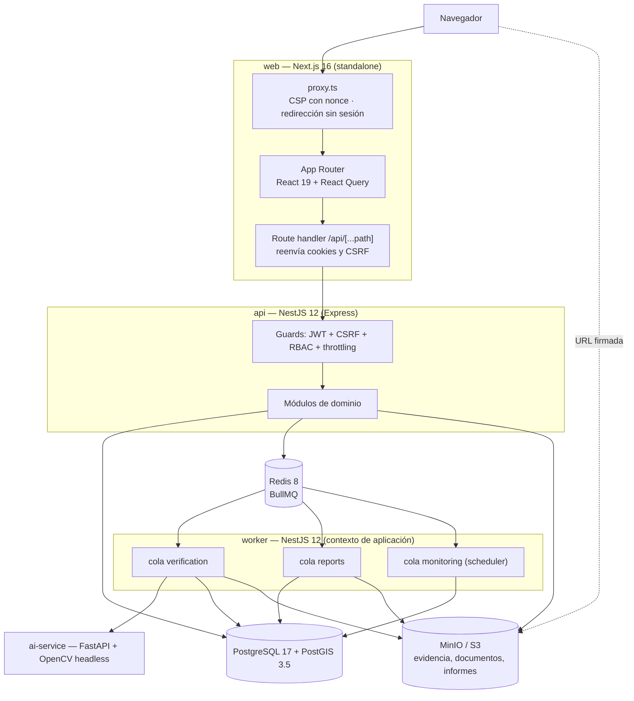
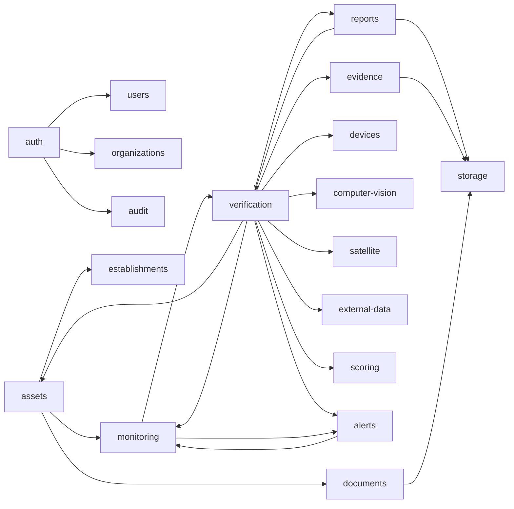
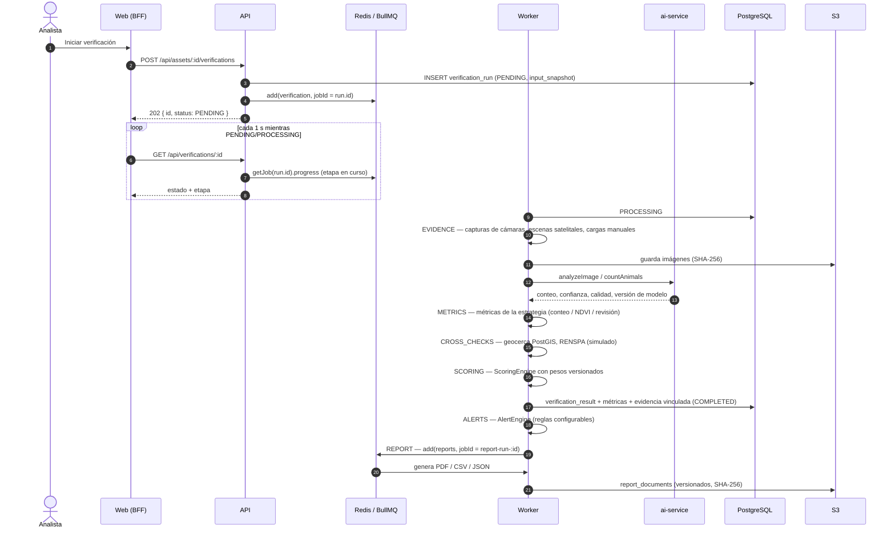
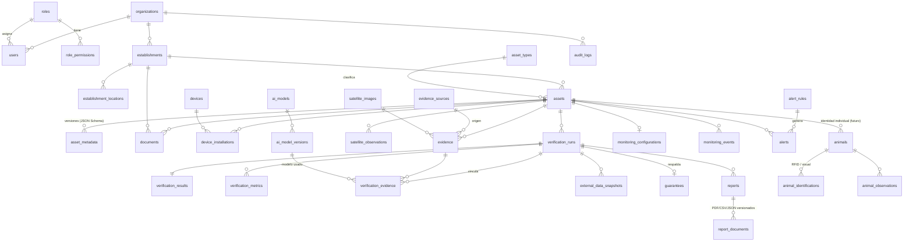

# Arquitectura de AgroGarantías

Plataforma de verificación remota y recurrente de activos agropecuarios usados como garantía
(bancos, aseguradoras). Este documento describe los componentes, los flujos principales, el
modelo de datos y las decisiones de arquitectura del MVP.

## 1. Vista de contexto



Las integraciones externas sin credenciales disponibles (cámaras, SENASA) están implementadas
como **proveedores simulados explícitos**: se identifican como tales en la base de datos
(`evidence_sources.is_simulated`, `external_data_snapshots.is_simulated`), en la UI (etiqueta
“Simulado”), en el score y en los informes PDF. Ninguna se presenta como integración real.

## 2. Contenedores



| Contenedor | Responsabilidad |
|---|---|
| `web` | UI, CSP por request, BFF: el navegador sólo habla con su propio origen; las cookies de sesión son `httpOnly`. |
| `api` | REST bajo `/api`, autenticación, autorización, validación, multi-tenancy, encolado de trabajos, URLs firmadas. |
| `worker` | Pipeline de verificación, generación de informes, monitoreo periódico. Escala independiente de la API. |
| `ai-service` | Análisis de imagen: calidad, conteo de animales, detección de cambios. Sin estado; autenticado con token interno. |
| `migrate` | Aplica migraciones, crea el bucket y carga los datos demo si la base está vacía. Termina al finalizar. |

## 3. Monolito modular (API)

Cada módulo sigue capas `domain` (reglas puras, sin Nest), `application` (casos de uso),
`infrastructure` (TypeORM, S3, colas, adaptadores) y `presentation` (controladores y DTOs).



Puertos (interfaces abstractas) y adaptadores:

| Puerto | Adaptadores | Selección |
|---|---|---|
| `ComputerVisionProvider` (`detectObjects`, `countAnimals`, `detectChanges`, `analyzeImage`) | `AiServiceComputerVisionProvider` (real, OpenCV), `MockComputerVisionProvider` | `CV_PROVIDER` |
| `SatelliteImageryProvider` (`searchImages`, `downloadImage`, `getMetadata`, `analyzeChange`) | `MockSatelliteProvider` (simulado), `StacSatelliteProvider` (búsqueda y metadatos reales vía STAC; el análisis no está disponible y lo informa) | `SATELLITE_PROVIDER` |
| `CameraGateway` | `SimulatedCameraGateway` (cuadros sintéticos por número de serie) | `CAMERA_GATEWAY` |
| `LivestockRegistryProvider` | `MockLivestockRegistryProvider` (fixtures SENASA/RENSPA) | `REGISTRY_PROVIDER` |
| `ObjectStorage` | `S3ObjectStorage` (MinIO, AWS S3 o compatible) | `S3_*` |

## 4. Flujo de verificación

La verificación es asíncrona, reproducible e inmutable. `POST` responde `202 Accepted` con el
id de la corrida; el job de BullMQ usa ese id como `jobId` (idempotencia) y reintenta con
backoff exponencial.



Estrategias por tipo de activo (`asset_types.verification_strategy`):

| Estrategia | Tipos | Evidencia | Medida |
|---|---|---|---|
| `LIVESTOCK_COUNTING` | Bovinos | Cámaras, cargas manuales | Cabezas detectadas por visión computacional |
| `VEGETATION_AREA` | Cultivos, Viñedos, Frutales, Forestal | Escena satelital sobre el polígono | Hectáreas con vegetación activa (NDVI) |
| `EVIDENCE_REVIEW` | Silobolsas, Silos, Maquinaria, Infraestructura, Reservorios, Otros | Fotos y cámaras | Actualidad, calidad, integridad y ubicación de la evidencia |

## 5. Score explicable

`ScoringEngine` es código de dominio puro (sin I/O), determinístico y versionado
(`agro-score/1.0.0`). Cada resultado guarda los pesos usados, los factores de cada componente y
la versión del modelo.

```
score = Σ peso_i × componente_i − penalización por anomalías
```

| Componente | Peso por defecto | Factores |
|---|---|---|
| Documentación | 20 % | Requisitos del tipo de activo, vigencia, revisión |
| Existencia verificada | 25 % | Coincidencia declarado/detectado × confianza, cantidad de evidencia |
| Historial | 20 % | Días distintos con verificación (180 días), estabilidad, score previo |
| Riesgo | 15 % | Movilidad, tenencia, seguro, alertas abiertas, cobertura de dispositivos, registro oficial |
| Consistencia | 20 % | Actualidad de la evidencia, geocerca, concordancia con el registro (comparado con toda la hacienda del establecimiento) |

Los pesos son configurables por organización (`PUT /api/organization/scoring/weights`, deben
sumar 1, quedan auditados) y no alteran verificaciones anteriores.

## 6. Modelo de datos



Decisiones del modelo:

- **Extensible por tipo**: `asset_types` define unidad, estrategia, fuentes de evidencia,
  documentación requerida y un **JSON Schema** de metadata (validado con Ajv en la API y
  renderizado como formulario en la UI). Agregar un tipo de activo no requiere migraciones.
- **Geografía nativa**: `geometry(Point|MultiPolygon, 4326)` con índices GIST; geocercas con
  `ST_DWithin`/`ST_Within`, superficies geodésicas con `ST_Area(geography)`.
- **Inmutabilidad en la base**: triggers rechazan `UPDATE/DELETE` sobre `evidence`,
  `verification_results`, `verification_metrics`, `external_data_snapshots` y `audit_logs`; una
  `verification_run` cerrada (`COMPLETED`/`FAILED`) no puede modificarse.
- **Invariantes con índices parciales únicos**: una sola verificación activa por activo, una sola
  alerta abierta por regla y activo, una sola garantía activa por activo.
- **Multi-tenancy**: `organization_id` en todas las entidades de negocio; los repositorios filtran
  siempre por la organización del usuario autenticado (nunca por parámetros del cliente).
- **Identidad individual (futuro)**: `animals`, `animal_identifications`, `animal_observations`
  existen y se exponen, pero el conteo no depende de RFID.

## 7. Seguridad

```mermaid
sequenceDiagram
    participant B as Navegador
    participant W as Web (BFF)
    participant A as API
    B->>W: POST /api/auth/login (email, contraseña)
    W->>A: reenvía
    A->>A: argon2id verify · bloqueo tras 5 intentos · throttling por IP
    A-->>B: Set-Cookie ag_at (JWT 15 min, httpOnly) · ag_rt (refresh, httpOnly, path /api/auth, SameSite=Strict) · ag_csrf (legible)
    B->>W: POST /api/... + x-csrf-token
    W->>A: reenvía cookies + header
    A->>A: JWT válido · CSRF double-submit · permisos del rol (cache 30 s) · organización
    Note over A: 401 → el cliente llama /auth/refresh una vez:<br/>rotación del refresh token; reutilización ⇒ revoca la familia
```

- Contraseñas con **argon2id** (parámetros OWASP); comparación en tiempo constante incluso para
  usuarios inexistentes.
- **RBAC**: roles Administrador, Analista de riesgo, Auditor y Consulta con permisos granulares
  (`assets:write`, `verifications:run`, `guarantees:confirm`, `settings:manage`, …).
- **CSRF** double-submit, **CORS** restringido a `WEB_ORIGIN`, **helmet** en la API y **CSP con
  nonce** por request en el frontend.
- **Rate limiting** global y específico para login (`RATE_LIMIT_*`), detrás de
  `TRUST_PROXY_HOPS` proxies confiables.
- **Archivos**: tipo detectado por firma binaria (no por extensión), tamaño máximo, nombre
  saneado, hash SHA-256; descarga sólo mediante **URLs firmadas** de vida corta.
- **Validación** con `class-validator` (`whitelist`, `forbidNonWhitelisted`) y metadata con
  JSON Schema estricto; CSV de informes con neutralización de fórmulas.
- **Auditoría** append-only de inicios de sesión, cargas, verificaciones, garantías, alertas,
  descargas y cambios de configuración.
- **Secretos** sólo por entorno; en `NODE_ENV=production` la API rechaza valores de desarrollo,
  `COOKIE_SECURE=false` y el proveedor de visión simulado.

## 8. Observabilidad

- Logs JSON estructurados (pino) con `request_id` propagado del BFF a la API y al servicio de
  visión; redacción de cookies, tokens y contraseñas.
- `GET /health/live` (proceso) y `GET /health/ready` (PostgreSQL, Redis, almacenamiento) en la
  API; `/health/live` y `/health/ready` en el servicio de visión.
- Errores con forma uniforme (`error`, `message`, `details`, `requestId`) y sin detalles
  internos. Los errores no controlados (HTTP 5xx y fallos definitivos de jobs) se envían al puerto
  `ErrorReporter`; el adaptador por defecto (`LogErrorReporter`) emite un log estructurado. Un
  proveedor de error tracking se integra implementando ese puerto.

## 9. Decisiones de arquitectura

| # | Decisión | Motivo | Consecuencia |
|---|---|---|---|
| 1 | Monolito modular NestJS + worker separado | Un equipo, dominio acotado; límites claros por módulo | Se puede extraer un módulo a servicio si escala distinto |
| 2 | Verificación asíncrona con BullMQ, `jobId = run.id` | Tareas largas, reintentos, idempotencia | El cliente consulta el estado; progreso real publicado por etapa |
| 3 | Resultado inmutable con snapshot de entrada, pesos y versión de modelos | Auditoría crediticia y reproducibilidad | Una nueva verificación nunca reescribe la anterior |
| 4 | Visión computacional en servicio Python separado | Ecosistema OpenCV/numpy; aislamiento de dependencias nativas | Contrato HTTP versionado; reemplazable por un modelo entrenado |
| 5 | Conteo con CV clásica (ExG + morfología + componentes) | Funciona sin datos de entrenamiento ni GPU; explicable | Confianza base 0,86 declarada; debe recalibrarse con imágenes de campo |
| 6 | Proveedores simulados explícitos | No hay credenciales de cámaras ni de SENASA | Marcados en datos, UI e informes; reemplazables vía puerto |
| 7 | BFF en Next.js con cookies `httpOnly` | El token nunca queda accesible a JavaScript | Todas las llamadas pasan por el origen del frontend |
| 8 | Metadata por JSON Schema en `asset_types` | Nuevos tipos de activo sin migraciones | Validación estricta en API y formulario generado en UI |
| 9 | PostGIS para geocercas y superficies | Cálculos espaciales correctos y con índices | Requiere imagen `postgis/postgis` |
| 10 | MinIO (Chainguard) en desarrollo | MinIO dejó de publicar imágenes oficiales | Cualquier S3 compatible sirve en otros entornos |
